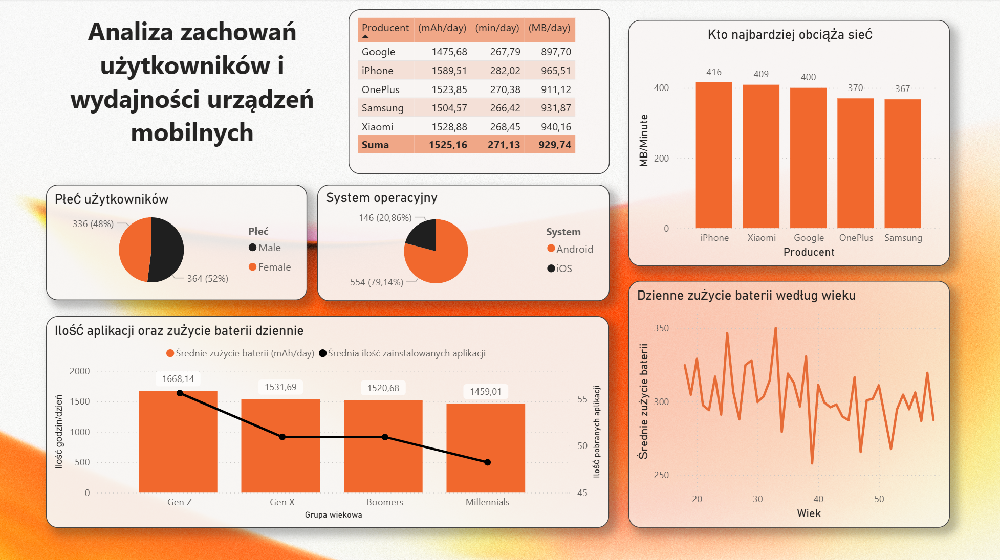

# 📱 Mobile Device Usage & User Behavior Analytics

## 🎯 Cel projektu
Celem projektu była analiza zachowań użytkowników telefonów komórkowych oraz korelacji między czasem używania aplikacji a zużyciem baterii i transferem danych.

## 🛠️ Stos technologiczny
* **Python (Pandas):** ETL, czyszczenie danych, feature engineering (stworzenie grup wiekowych).
* **Power BI:** Wizualizacja danych, modelowanie i miary DAX.

## 📊 Dashboard

## 💡 Kluczowe wnioski (Insights)
1. **Korelacja Bateria-Użycie:** Grupa Gen Z wykazuje wyższe zużycie baterii przy mniejszej liczbie zainstalowanych aplikacji w porównaniu do Boomersów.
2. **Transfer Danych:** Użytkownicy iPhone'ów generują średnio więcej ruchu sieciowego na minutę pracy ekranu.

## 🚀 Jak uruchomić?
1. Skrypt czyszczący dane znajduje się w folderze `/scripts`.
2. Raport `raport.pbix` można otworzyć w Power BI Desktop.